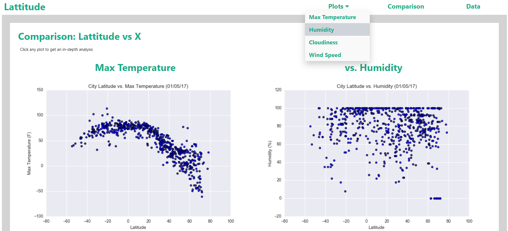
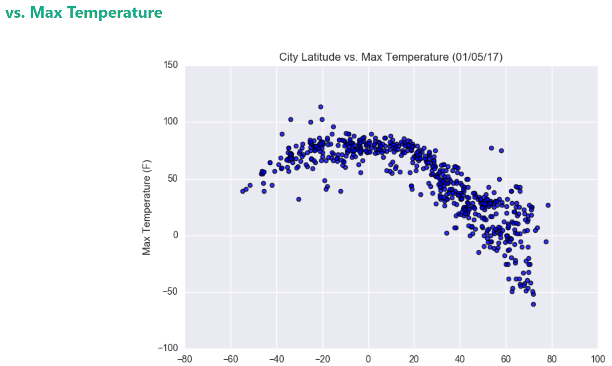
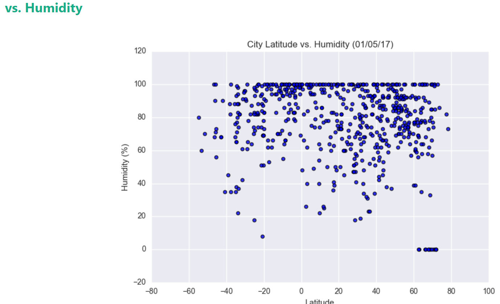
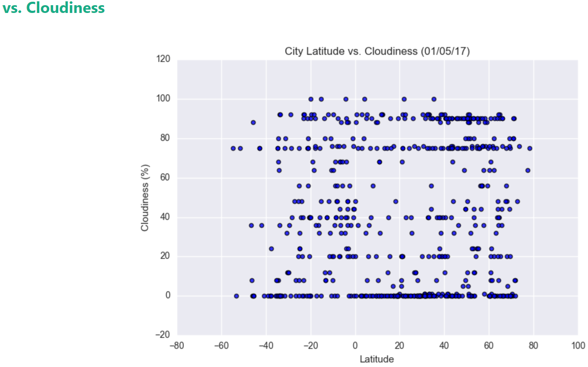
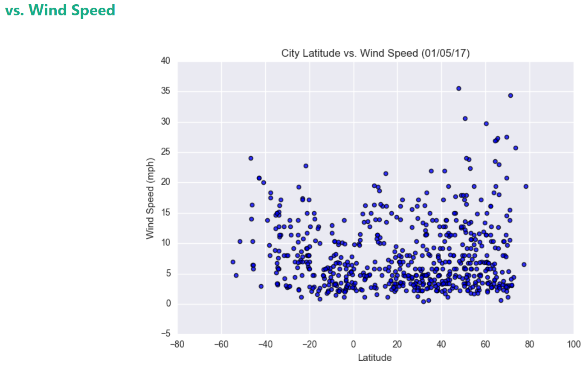
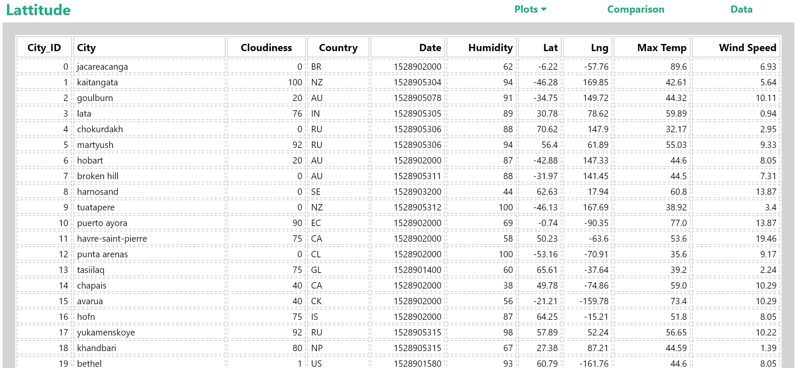

# Web Visualization Dashboard

The purpose of this project was to analyze how weather changes as you get closer to the equator. Th accomplish this analysis, we first pulled data from the OpenWeatherMap API to assemble a dataset on over 500 cities.

After assembling the dataset, we used Matplotlib to plot various aspects of the weather vs. latitiude. Factors we looked at included: temperature, cloudiness, wind speed, and humidity. This site provides the source data and visualizations created as part of the analysis, as well as explanations and descriptions of any trends and correlations witnessed.

